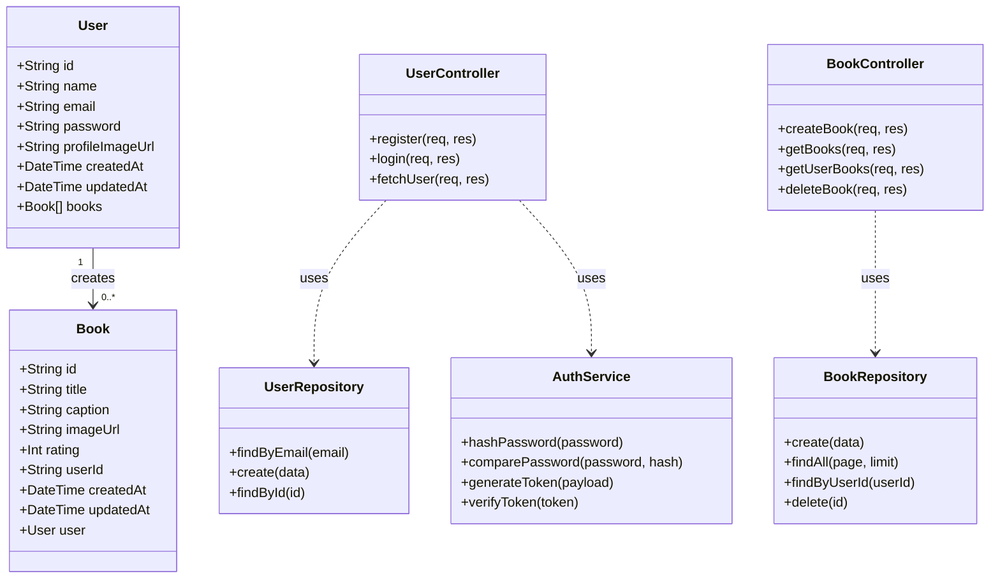
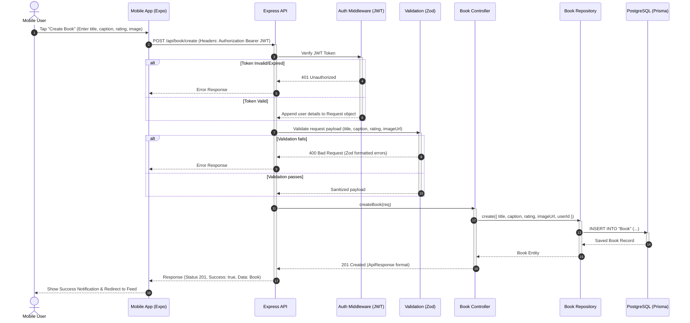

# Book Store Monorepo

Welcome to the **Book Store** project! This is a modern, production-ready full-stack monorepo featuring a secure RESTful API and a cross-platform React Native mobile application. The codebase is organized as a monorepo powered by **Turborepo** and **pnpm workspaces** for optimized build times and clean package management.

---

## 📌 Architecture & Design

### 1. Class Diagram
The class diagram below displays the core backend data structures, database relationships, and the logical architecture of the application services, controllers, and repositories.



### 2. Sequence Diagram: Book Creation Workflow
This sequence diagram outlines the end-to-end request flow when a user uploads/creates a new book entry from the Mobile client application to the Backend API.



---

## 📁 Monorepo Layout

```
.
├── apps/
│   ├── api/             # Backend Express & Prisma API application
│   └── mobile/          # Frontend React Native Expo mobile application
├── package.json         # Workspace root scripts
├── pnpm-workspace.yaml  # pnpm workspace definition
└── turbo.json           # Turborepo build pipeline configuration
```

---

## ⚡ Quick Start (Local Setup)

### Prerequisites
- [Node.js](https://nodejs.org/) (v18+)
- [pnpm](https://pnpm.io/) (v8+)
- [PostgreSQL](https://www.postgresql.org/) database running locally or in the cloud.

### 1. Installation
Clone the repository and install dependencies at the root of the project:
```bash
pnpm install
```

### 2. Environment Configurations
Configure the local environment variables. Create a `.env` file in both `apps/api` and `apps/mobile`:

#### **For API (`apps/api/.env`)**:
```env
PORT=3000
DATABASE_URL="postgresql://<user>:<password>@localhost:5432/<dbname>?schema=public"
JWT_SECRET="your-super-secure-jwt-secret-key"
CLOUDINARY_CLOUD_NAME="your-cloudinary-name"
CLOUDINARY_API_KEY="your-cloudinary-key"
CLOUDINARY_API_SECRET="your-cloudinary-secret"
```

#### **For Mobile (`apps/mobile/.env`)**:
```env
EXPO_PUBLIC_API_URL="http://localhost:3000"
```

### 3. Setup the Database (Prisma)
Run the following commands inside `apps/api` (or prefix with `pnpm --filter @repo/api`) to apply database migrations and seed default records:
```bash
# Generate Prisma Client
pnpm --filter @repo/api run postinstall

# Run migrations
pnpm --filter @repo/api exec prisma migrate dev

# Seed database (optional)
pnpm --filter @repo/api run seed
```

### 4. Running the Project
To run both the backend API and the mobile app concurrently in development mode, execute:
```bash
pnpm dev
```

---

## 🔌 API Service (`apps/api`)

The API service is built using Express, TypeScript, and Prisma ORM.

### Key Tech Stack
- **Framework**: Express with TypeScript
- **Database Access**: Prisma Client with PostgreSQL adapter
- **Security & Validation**: `jsonwebtoken`, `bcrypt` for password hashing, `cors`, `express-rate-limit` for rate limiting, and `zod` for API schema validation.
- **Documentation**: Swagger API specification (`swagger-ui-express`)
- **Logging**: Winston logger

### Key API Endpoints
All API responses follow a standard unified format:
```json
{
  "statusCode": 200,
  "success": true,
  "message": "Action message",
  "data": { ... }
}
```

#### Authentication Routes (`/api/auth`)
* `POST /api/auth/register` - Registers a new user. Expects `name`, `email`, and `password`.
* `POST /api/auth/login` - Logs in a user. Returns a JWT token and user profile details.
* `GET /api/auth/user` - Fetches authenticated user info. *Requires Bearer Token*.

#### Book Routes (`/api/book`)
* `POST /api/book/create` - Creates a new book entry. *Requires Bearer Token*.
* `GET /api/book/get` - Gets a paginated list of all books. *Requires Bearer Token*.
* `GET /api/book/user` - Gets all books created by the logged-in user. *Requires Bearer Token*.
* `DELETE /api/book/:id` - Deletes a specific book. *Requires Bearer Token*.

---

## 📱 Mobile App Client (`apps/mobile`)

The mobile application is a React Native app built using Expo SDK 54 and Expo Router.

### Key Tech Stack
- **Framework**: Expo (React Native) with Expo Router (file-based navigation)
- **Data Fetching**: TanStack React Query for request caching, caching synchronization, and query states.
- **Client Network**: Axios configured with interceptors for attaching JWT headers.
- **Forms**: React Hook Form with Zod integration.
- **Secure Persistence**: `expo-secure-store` to keep the user authentication JWT token secure on the device.
- **Image Handling**: `expo-image-picker` to select profile or book images from the device gallery.

### Application Layout
The application uses Expo Router's directory structure to enforce separation between authentication screens and authorized pages:
- **`app/_layout.tsx`**: Roots layout; configures query clients, routes, and auth contexts.
- **`app/(auth)/`**: Handles unauthenticated screens:
  - `login.tsx` - Login screen
  - `register.tsx` - Account registration screen
- **`app/(app)/`**: Handles authenticated pages (using a JWT check):
  - **`app/(app)/(tabs)/`**: Tab navigation:
    - `index.tsx` - Main feed displaying all books
    - `create.tsx` - Add a new book page (including image capture/picker)
    - `profile.tsx` - User details and a list of personal books uploaded with logout utility.

---

## 🧪 Verification & Best Practices

### Code Quality & Formatting
Ensure typescript consistency and follow standards with:
```bash
# Lint backend & mobile applications
pnpm lint
```

### API Interactive Testing
Once the API server is running locally, access the interactive Swagger Documentation at:
👉 **[http://localhost:3000/api-docs](http://localhost:3000/api-docs)**
